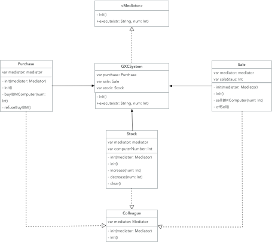

#  中介者模式

###通用类图

* Mediator 抽象中介者
* ConcreteMediator 具体中介者
* Colleague 抽象同事角色

### 定义

​	用一个中介对象封装一系列的对象交互，使各个对象不需要显示地相互作用，从而使其耦合松散，并且可以独立地改变他们之间的交互。

### 优点

​	减少类间依赖，把原有的一对多的依赖变成了一对一的依赖，同事类只依赖中介者，降低了耦合。

### 缺点

​	中介者会膨胀的很大，且同事类越多，中介者的逻辑越复杂。

### 如下情况可以尝试使用中介者模式

 * N个对象之间产生了相互依赖关系（N>2）
 * 多个对象有依赖关系，但是依赖关系的行为尚不确定或者有发生改变的可能，在这种情况下一般建议采用中介者模式，降低变更引起的风险扩散

### 使用场景

​	几个类的简单依赖就没必要用。中介者模式适用于多个对象之间紧密耦合的情况，紧密耦合的标准是: 在类图中出现了蜘蛛网装结构，在这种情况下一定要考虑使用中介者模式，将蜘蛛网梳理为星型结构。

​	将同事类的业务逻辑进行拆分，自己能实现的自己实现，不能自己实现的交给中介者实现。

	#### 机场调度中心 

​	航站楼是现场的指挥中心，是中介者

	#### MVC

​	Controller 就是一个中介者

####媒体网关

​	如 MSN 服务器，接收消息，转发消息

#### 中介服务

​	各种中介：房屋中介、出国中介等

### 栗子-供销存

### 存疑

#### 路由设计是不是中介者模式

