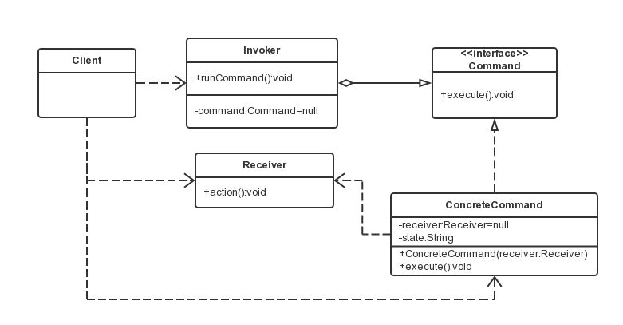

#  命令模式

### 定义

​	将一个请求封装成对象，从而使用不同的请求把客户端参数化，对请求排队或者记录请求日志，可以提供命令的撤销和恢复功能。

### 优点

 * **类间解耦：**调用者(invoker)和接收者(receiver)之间没有依赖关系，调用者实现功能时只需调用Command抽象类的execute方法就可以，不需要了解到底是哪个接收者执行
 * **可扩展性：** Command的子类可以非常容易地扩展，而且调用者(invoker)和高层次的模块(client)不产生验证的代码耦合
 * **命令模式结合其他模式会更优秀：** 可以结合责任链模式，实现命令族解析任务；结合模板方法模式，可以减少Command子类的膨胀问题

### 缺点

​	Command子类容易膨胀

